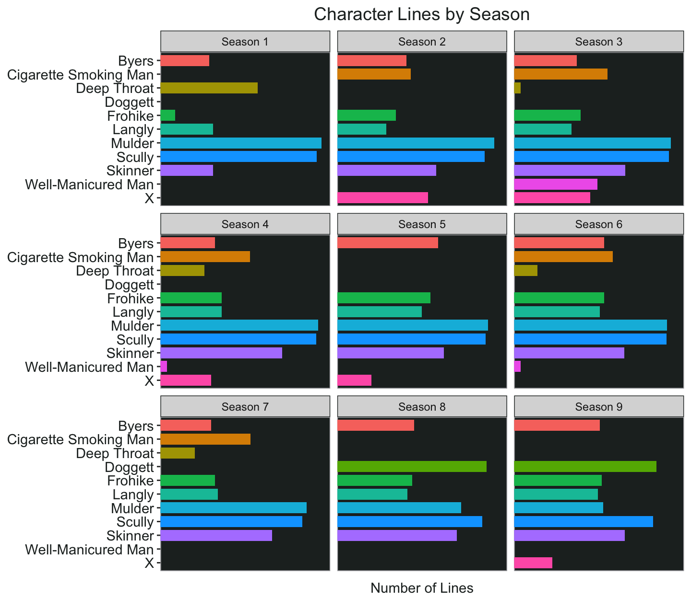

A Test 


```r
ep_text <- readRDS("~/Desktop/site/content/blog/2021-01-03-the-truth-is-out-there-part-ii/ep_text.RDS")
```


```r
speakers <- ep_text %>% 
  count(season, speaker) %>% 
  filter(speaker %in% c("Mulder", "Scully", "Skinner", "Cigarette Smoking Man", "Frohike", "Langly", "Doggett", "Byers",  "X", "Deep Throat", "Well-Manicured Man")) %>% 
  arrange(season, desc(n))

speakers<-speakers %>% 
  mutate(n2 = round(log(n), 2),
         speaker2 = factor(speaker)) %>% 
  mutate(n2 = ifelse(n2 <.5,.3, n2))
```


```r
speakers %>% 
  ggplot(aes(fct_rev(speaker2), n2,fill =speaker2)) +
  geom_col(show.legend = FALSE, width = .8, position = position_dodge(0.7))+
  facet_wrap(~season, nrow = 3)+
  scale_y_continuous(limits = c(0,8), expand = c(0,0))+
  coord_flip()+
  labs(title = "Character Lines by Season", y = "Number of Lines")+
  my_theme2
```




